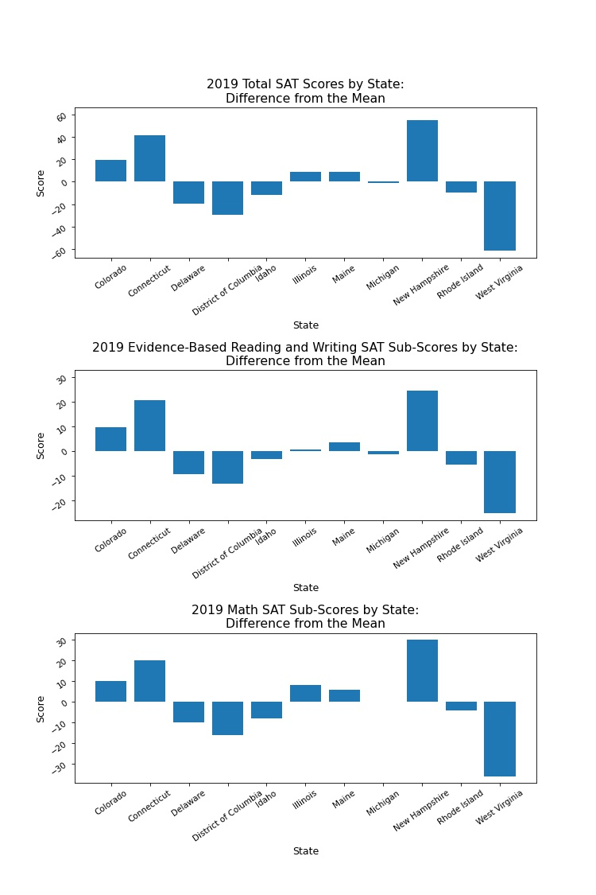

# SAT Scores Among States with Compulsory Requirements

Jennifer Brown, General Assembly - DSIR-2-8
February 2021

## Problem Statement

*Ten states and the District of Columbia require the SAT as a graduation requirement or offer its administration free of charge. This project examines the sub-scores (Math and Evidence-Based Reading and Writing) so these states can allocate funding or make curriculum adjustments for subjects in test areas exhibiting poor sub-scores.*

## Background and Executive Summary

This project is limited to states/territories that require the SAT for graduation OR offered the test free of charge in 2018 and 2019. The reasoning for this restriction was to avoid any self-selection bias ([*source*](https://blog.prepscholar.com/which-states-require-the-sat)) where motivated or college-bound students are the only individuals taking the SAT. Such bias has potential to skew results. Other research illustrates the effect of self-selection bias and notes a negative relationship between participation and the mean SAT score ([*source*](https://blog.prepscholar.com/which-states-require-the-sat)). This research attempts to avoid this effect by only looking at states with the SAT requirement and thus, a high rate of participation.

States that require or offer free SAT administration ([*source*](https://blog.prepscholar.com/which-states-require-the-sat)):

* Colorado
* Connecticut
* Delaware
* District of Columbia
* Idaho
* Illinois
* Maine
* Michigan
* New Hampshire
* Rhode Island
* West Virginia

Sections of the SAT include reading, writing and language, math and an optional essay ([*source*](https://www.princetonreview.com/college/sat-sections)). These sections are scored into two sub-scores: Math and Evidence-Based Reading and Writing ([*source*](https://collegereadiness.collegeboard.org/pdf/understanding-sat-scores.pdf)).

The Python programming language and the libraries Pandas, Numpy, Matplotlib, and Seaborn were used to import, clean and process, analyze, and visualize the data. Findings are displayed in table form, boxplots, and bar graphs.

Overall, states will lower subscores in one area tend to have lower subscores in the other subject area. For example, lower subscores in Evidence-Based Reading and Writing (EBRW) also have lower than mean subscores in Math. Lower scores in 2018 also tend to have lower scores in 2019.

## Data Dictionary

|Feature|Type|Dataset|Description|
|---|---|---|---|
|state|object|sat_final|State name| 
|participation_rate_18|float|sat_2018.csv|2018 SAT participation rate for all eligible students| 
|ebrw_score_18|int|sat_2018.csv|2018 SAT subscore average on the Evidence-Based Reading and Writing section| 
|math_score_18|int|sat_2018.csv|2018 SAT subscore average on the Math section| 
|total_score_18|int|sat_2018.csv|2018 SAT average for subsections combined (Total Score)| 
|participation_rate_19|float|sat_2019.csv|2019 SAT participation rate for all eligible students| 
|ebrw_score_19|int|sat_2019.csv|2019 SAT subscore average on the Evidence-Based Reading and Writing section| 
|math_score_19|int|sat_2019.csv|2019 SAT subscore average on the Math section| 
|total_score_19|int|sat_2019.csv|2019 SAT average for subsections combined (Total Score)| 

## Conclusions

States with lower than the mean subscores for one section of the SAT tend to have lower scores for the other subsection. This is especially true for states where the difference from the mean is several points lower. This trend also holds for states with scores in the positive direction above the mean. This is consistent for each state whether the year examined in 2018 or 2019.

Additionally, EBRW and Math subscores tend to be the same amount of points away from the mean for each individual state. This pattern tends to hold for both 2018 and 2019 for each state.

*See graphs and tables in the 'assets' folder for greater detail.

## Recommendations

* Examine higher scoring states. What are New Hampshire and Connecticut doing well within their educational curriculums that lead to higher than mean scores?
    * The District of Columbia and West Virginia have lowest mean subscores and may benefit from working with officials in New Hampshire and Connecticut.

* Consider offering state-level designed SAT practice or preparation free of charge to all students.

* Suggest non-school related prep courses to interested students
    * Some SAT prep costs money and some are offered free of charge
        * Cost: ([*Princeton Review*](https://www.princetonreview.com/college/sat-test-prep))
        * Free: ([*Khan Academy*](https://www.khanacademy.org/sat))

# Sources
* (1) https://blog.prepscholar.com/which-states-require-the-sat
* (2) https://www.princetonreview.com/college/sat-sections
* (3) https://collegereadiness.collegeboard.org/pdf/understanding-sat-scores.pdf
* (4) https://www.statisticshowto.com/self-selection-bias/
* (5) https://fredrikdeboer.com/2017/03/29/why-selection-bias-is-the-most-powerful-force-in-education/
* (6) https://www.princetonreview.com/college/sat-test-prep
* (7) https://www.khanacademy.org/sat